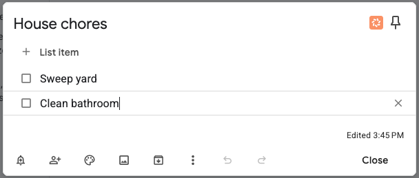
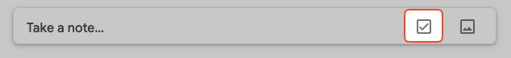
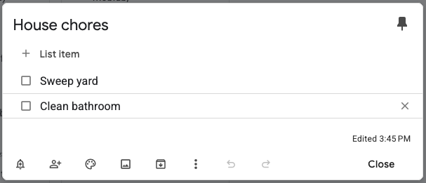
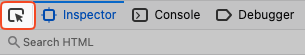

# Google Keep on TRML
## Introduction
I wanted to display my Google Keep todo list on my TRMNL device. Rather than implementing a pull mechanism, this project uses Tampermonkey to add a PUSH button on any list.

Why do I prefer a push?
- I have a todo list for each project I am working on. I want to be able to switch projects. This means that the point of control (to select a project) is actually the Google Keep page. So it makes sense to have the button there.
- There is no public API for Google Keep, and even if there was: how would I switch between projects?

## The result
The image below shows the todo list with the TRMNL button added:



When you press the button, the first 5 items of the list will be pushed to the TRML server. There will be a delay before it appears on your device, as configured in the device settings.

## Installing
### Step 1: Configure your private plugin
- Create a private plugin with a **Webhook** strategy.
- At the bottom of the page, the Webhook URL is displayed. It will look something like: `https://usetrmnl.com/api/custom_plugins/5d3e5a26-a32b-40dc-9c58-9a95fef88df7`
- Click on the Edit Markup button and enter the markup:

```
<div class="layout layout--col layout--top">
  
  <div class="item">
    <div class="meta"></div>
    <div class="content">
      <span class="title title--large">{{ item }}</span>
    </div>
  </div>
  
</div>
```

### Step 2: Install the Tampermonkey script
- Install the [Tampermonkey](https://www.tampermonkey.net/) browser extension
- In Tampermonkey, create a new script. Copy & Paste the content from 
- Edit the script on line 15 to refer to your Webhook URL
- Choose File > Save

### Step 3: Invoke the script
- Go to Google Keep
- Open a list. You should see the TRML button at the top
- Press the button

### Step 4: Troubleshooting
If you are not seeing your list on TRML, open de browser console. The result of the call to your webhook URL is logged there.

If you want to see the device updated sooner, lower the refresh rate to 5 minutes in the device settings:

.

## Creating the script
I am documenting the steps here because the ID's that we're using might change. I am using the Firefox browser.

Go to [Google Keep](https://keep.google.com/#home) and create a new list.



Populate the list. Now click the list to enter the Edit dialog:



Click on the hamburger menu in Firefox (on the right) > More Tools > Web Developer Tools.
Click on the Element Picker:

.

Hover over the **pin** in the top-right of the window to find the relevant HTML for the pin. It should look like this:

```
<div role="button"
class="Q0hgme-LgbsSe Q0hgme-Bz112c-LgbsSe IZ65Hb-nQ1Faf VIpgJd-LgbsSe"
tabindex="0"
style="user-select: none;"
data-tooltip-text="Pin note"
aria-label="Pin note" aria-pressed="false">
</div>
```
On a longer list with a scroll bar it looks like this:

```
<div role="button"
class="Q0hgme-LgbsSe Q0hgme-Bz112c-LgbsSe IZ65Hb-nQ1Faf VIpgJd-LgbsSe K4efff"
tabindex="0" style="user-select: none;" data-tooltip-text="Unpin note" aria-label="Unpin note" aria-pressed="true"></div>
```
So we can conclude that the class name can vary, but starts with the same string.

Find the div a few levels up that surrounds the modal edit window. It will look like this:

```
<div class="VIpgJd-TUo6Hb XKSfm-L9AdLc eo9XGd"
tabindex="0" 
style="left: 549.5px; top: 145.75px;">
```

### The JSON payload
The POST body looks like this:

```
{
  "merge_variables": {"items": [
    "Sweep yards",
    "Clean bathroom"
  ]}
}
```

I used https://webhook.site for testing the POST message.